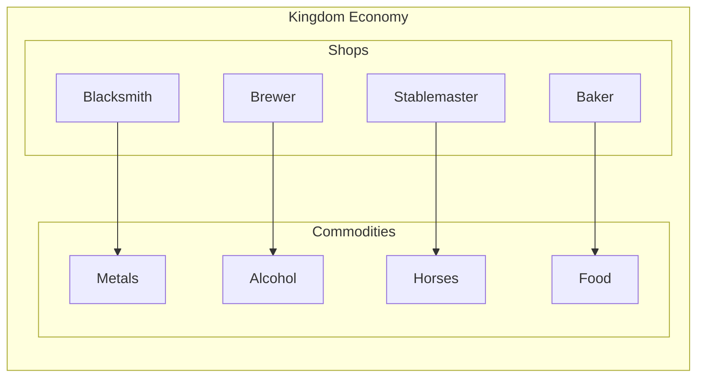

<!-- Economy_System_Overview.md -->
<!-- TODO: durf 10/4/25 Rework overview to show how goods flow into kingdom
to/from the player. -->

### Economy System

#### Overview

This is the general overview of how commodities flow through the kingdom.

#### DRAFT - Ideation - Kingdom Economy

