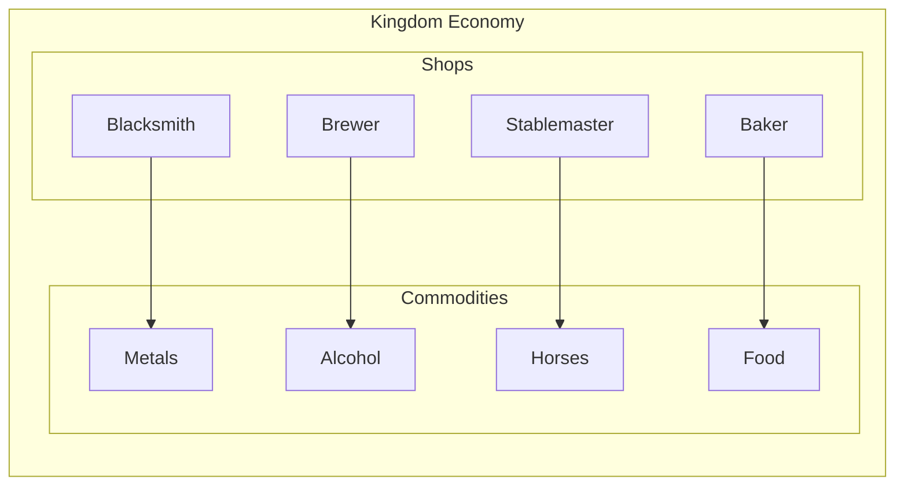

<!-- Economy_System.md -->
<!-- TODO: Rework overview to show how goods flow into the kingdom inlcuding
to/from the player. -->

### Economy System

#### Overview

This is the general overview of how commodities flow through the kingdom.

#### DRAFT - Ideation - Kingdom Economy

