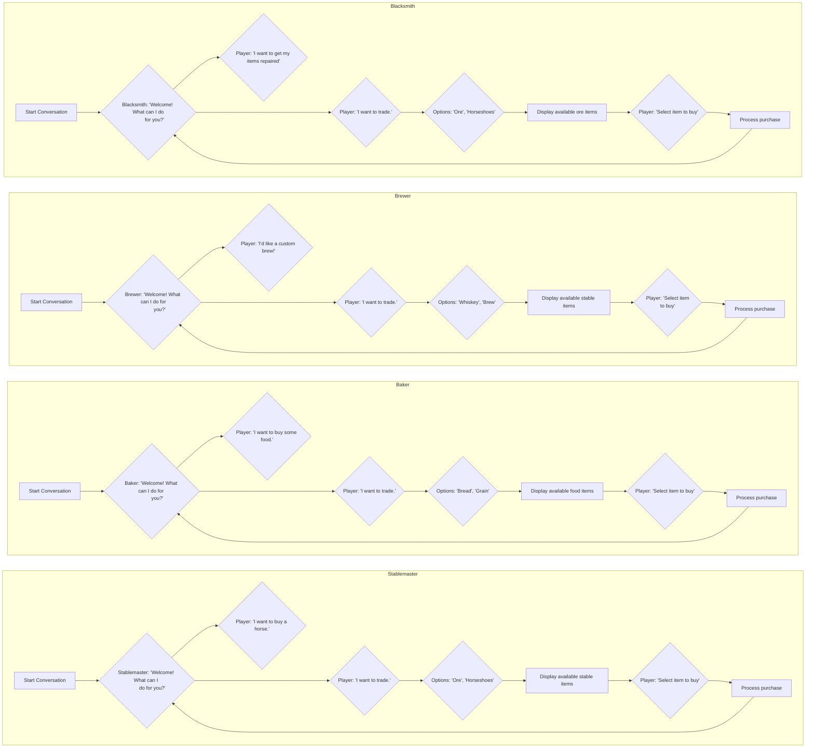

<!-- Dialog_Choices_Diagram.md -->
<!-- This diagram will be used for automating changes to dialogue and 
dialogue-mapping later -->
<!-- DONE: Reformat for pep8 (79 character lines) -->

```mermaid
graph LR
    
    subgraph Stablemaster
        direction LR
        SM_Start[Start Conversation] --> SM{Stablemaster: 'Welcome! What can I 
        do for you?'};
        SM ---> SM_Trade{Player: 'I want to trade.'};
        SM --> SM_Services{Player: 'I want to buy a horse.'};

        SM_Trade --> SM_Trade_Opts{Options: 'Ore', 'Horseshoes'};
        SM_Trade_Opts --> SM_Opts[Display available stable items];
        SM_Opts --> SM_Buy{Player: 'Select item to buy'};
        SM_Buy --> SM_Purch[Process purchase];
        SM_Purch --> SM;
    end

    subgraph Baker
        direction LR
        BK_Start[Start Conversation] --> BK{Baker: 'Welcome! What can I do for 
        you?'};
        BK ---> BK_Trade{Player: 'I want to trade.'};
        BK --> BK_Services{Player: 'I want to buy some food.'};

        BK_Trade --> BK_Trade_Opts{Options: 'Bread', 'Grain'};
        BK_Trade_Opts --> BK_Opts[Display available food items];
        BK_Opts --> BK_Buy{Player: 'Select item to buy'};
        BK_Buy --> BK_Purch[Process purchase];
        BK_Purch --> BK;
    end

    subgraph Brewer
        direction LR
        BR_Start[Start Conversation] --> BR{Brewer: 'Welcome! What can I do for
         you?'} ---> BR_Trade{Player: 'I want to trade.'} 
        BR --> BR_Services{Player: 'I'd like a custom brew!'};

        BR_Trade --> BR_Trade_Opts{Options: 'Whiskey', 'Brew'} --> 
        BR_Opts[Display available stable items] --> BR_Buy{Player: 'Select item
         to buy'};
        BR_Buy --> BR_purch[Process purchase];
        BR_purch --> BR;
    end
    
    subgraph Blacksmith
        direction LR
        BS_Start[Start Conversation] --> BS{Blacksmith: 'Welcome! What can I do
         for you?'} ---> BS_Trade{Player: 'I want to trade.'};
        BS --> BS_Services{Player: 'I want to get my items repaired'};

        BS_Trade --> BS_Trade_Opts{Options: 'Ore', 'Horseshoes'};
        BS_Trade_Opts --> Ore[Display available ore items];
        Ore --> BS_Buy{Player: 'Select item to buy'};
        BS_Buy --> BS_purch[Process purchase];
        BS_purch --> BS;
    end
```