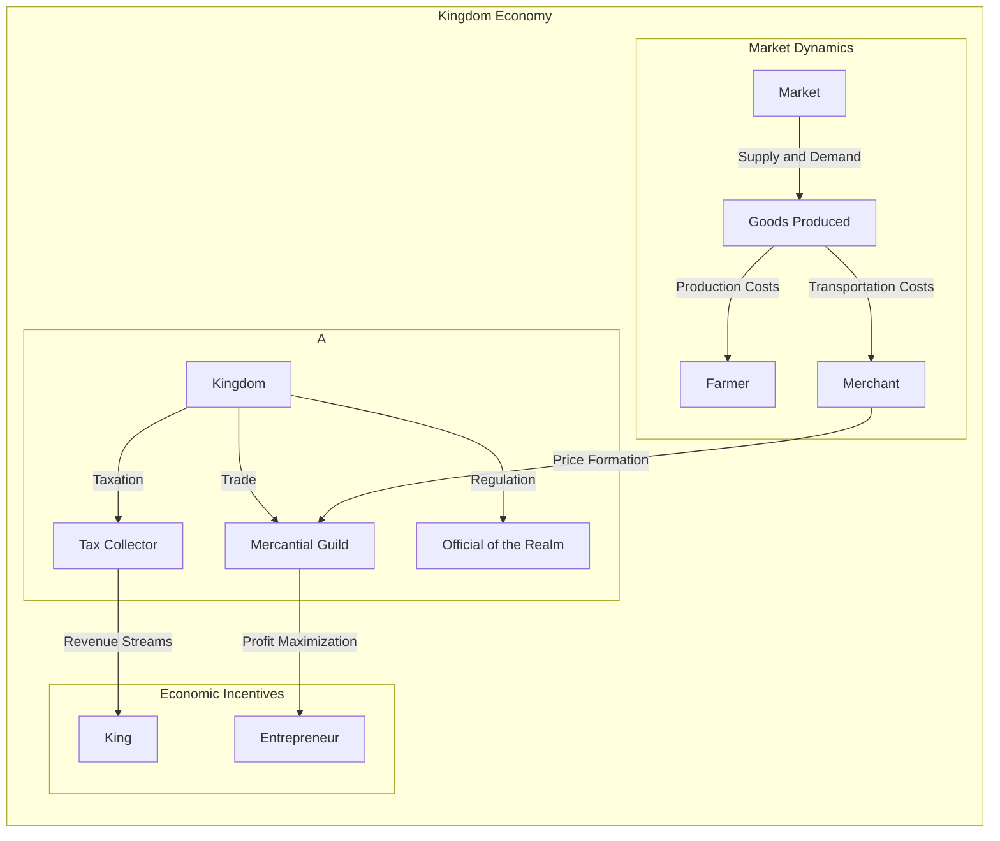

# AI generated

## Economy System for Medieval Trading Game

### Overview

The medieval economy system is designed to simulate the complex relationships between different groups within a kingdom.

### Graph Description

This Mermaid code defines a directed graph that illustrates the key components of a medieval economy system. The different parts of the kingdom are represented by sub-graphs, including the Kingdom Economy, Market Dynamics, and Economic Incentives.

The Kingdom Economy sub-graph shows how the King collects taxes, regulates trade, and interacts with Mercantile Guilds.

The Market Dynamics sub-graph illustrates how goods are produced, transported, and traded in the market, with supply and demand influencing prices.

Finally, the Economic Incentives sub-graph highlights the incentives for tax collectors to maximize revenue for the King, merchants to profit from trade, and entrepreneurs to innovate.

###################################

## 
## Key Components
 
    **1. Trading Commodities
    **2. Decisions affect commodties
    **3. Transaction records over time
    **4. WorldClock Counter (Event will force movement to make decisons)
    **5. Wallet
    **6. Inventory

### Trading Commodities
    **1. Corn
    **2. Horses
    **3. Whiskey
    **4. Boots
### Decisions affect commodties
    **1. Value
    **2. Supply/Demand
### Transaction records over time
    **1. Price History
    **2. Average Prices
    **3. Quantity Total
### Timer/Counter to force movement make decisons
    **1. Expected event timer
    **2. Events based on world timer

## Goals
    **1. Event times generate rewards/consequences