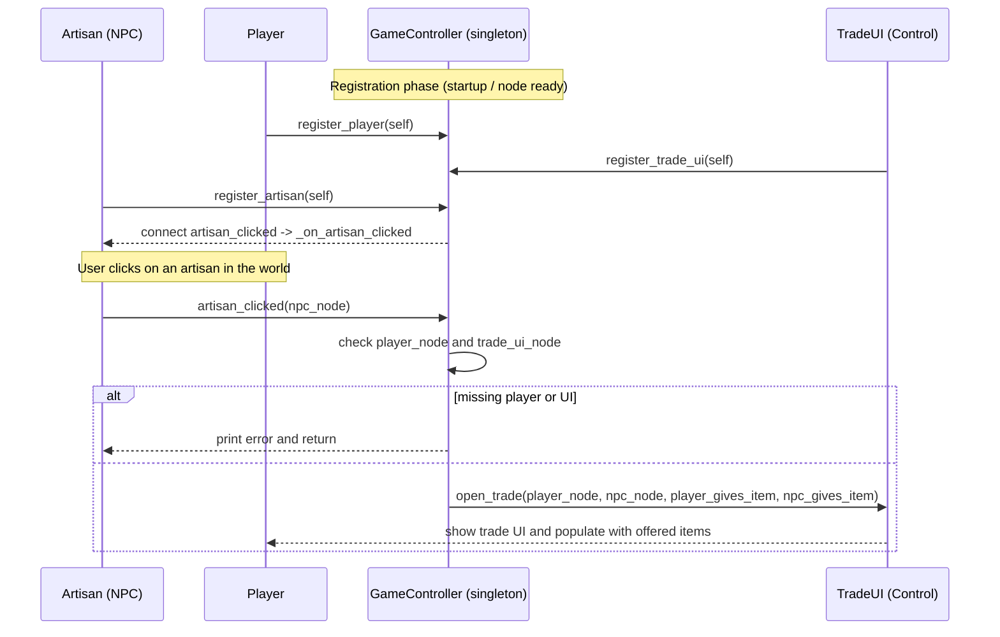

**Game Controller — System Architecture**

This document explains how `game_controller.gd` works, its responsibilities, and the runtime flow when an artisan NPC is clicked to start a trade. It includes a Mermaid sequence diagram mapping registration and the trade flow.

**Purpose**: `game_controller.gd` is a small singleton-style Node that centralizes registration of key nodes (player, trade UI, artisans) and handles global interactive logic (e.g., responding to artisan clicks and opening the trade UI).

**Key Responsibilities**
- **Register nodes**: Accept references from important nodes via `register_player`, `register_trade_ui`, and `register_artisan`.
- **Connect signals**: When an artisan registers, connect its `artisan_clicked` signal to the controller's handler (`_on_artisan_clicked`).
- **Coordinate interactions**: On artisan click, validate that `player_node` and `trade_ui_node` are present, determine trade parameters, and instruct the trade UI to open.

**Public API (functions)**
- `register_player(player: Node)` : store reference to the player node.
- `register_trade_ui(ui: Control)` : store reference to trade UI and hide it initially.
- `register_artisan(artisan: Node)` : register an artisan and connect its `artisan_clicked` signal to `_on_artisan_clicked`.
- `_on_artisan_clicked(npc_who_was_clicked: Node)` : central handler called when an artisan emits the click signal. Performs safety checks and calls `trade_ui_node.open_trade(...)`.

**Runtime flow (sequence)**

**Notes & Implementation Details**
- `register_trade_ui` hides the trade UI immediately on registration to ensure it starts hidden.
- `register_artisan` only connects the artisan's `artisan_clicked` signal if it isn't already connected (defensive).
- `_on_artisan_clicked` currently uses placeholder hard-coded trade items (`npc_gives_item = "Sword"`, `player_gives_item = "Coins"`). There is a TODO to move trade determination to a helper or to pull from NPC data.
- Error handling is minimal: the handler prints an error and returns if required nodes are not registered.

File: `singleton/game_controller.gd`
